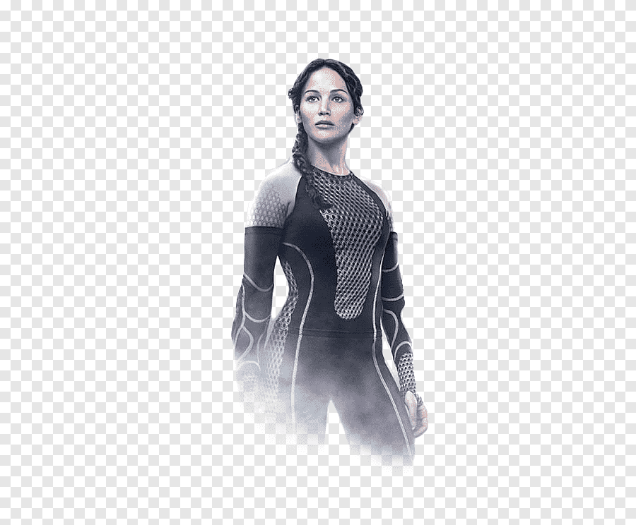

### DATA VISUALIZATION

<h4> THESE ARE THE FOLLOWING DATA THAT HAS BEEN RESEARCHED </h4>
<ul>
  <li> <b>covid-variants datasets </b>
   
    
  </li>
  <li><b>Military Expenditure datasets</b>
    
     
  </li>
  <li><b> Hunger Games Novel </b> </li>
   
  
  | Images        | Name           | 
  | ------------- |:-------------:|
  |      | Peeta | 
  |     | Jenniffer     |  
  |   | Hunger Games      |   
   
    
   
  </ul>

### PROGRAMMING LANGUAGE AND TOOLS:
<a href="https://www.python.org" target="_blank">  
